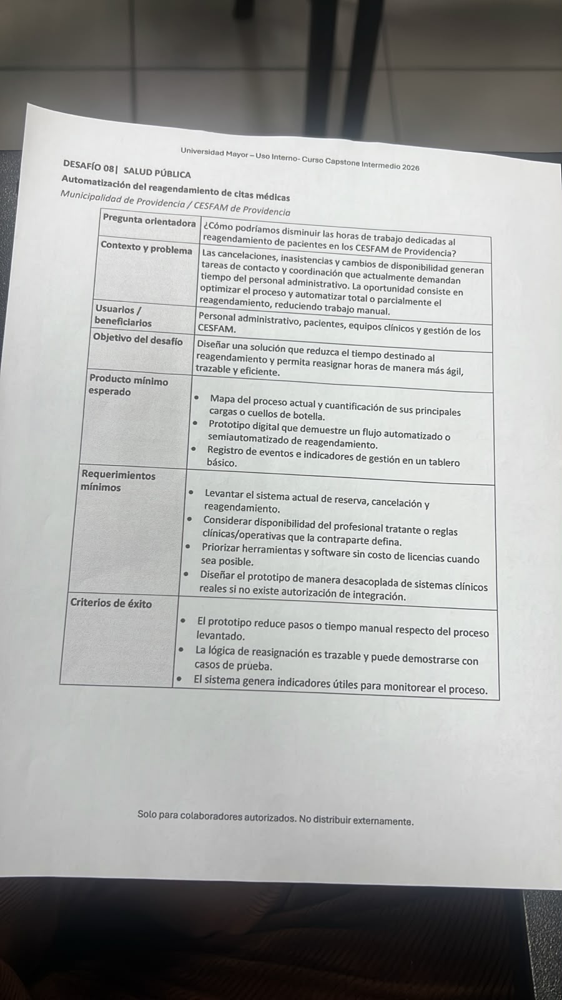
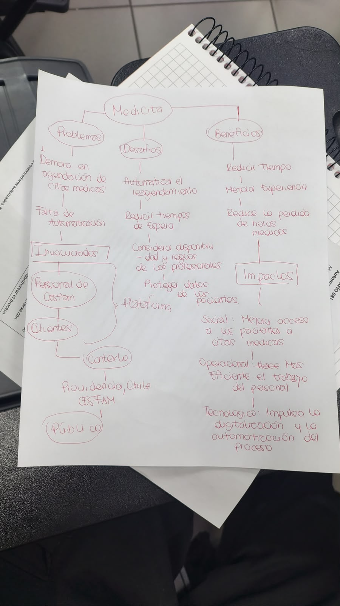
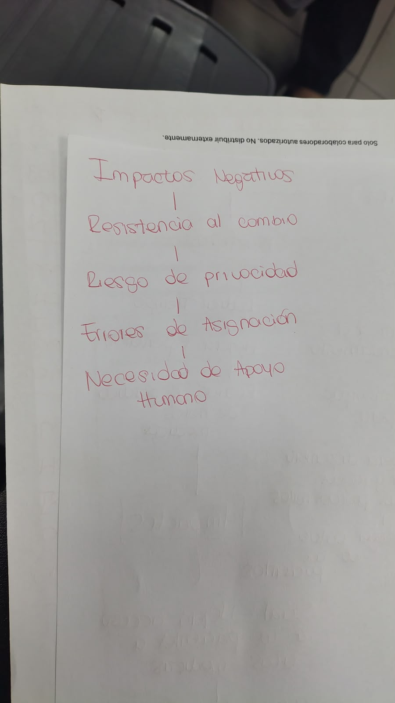

# Sesión 1 — Contrato de equipo e investigación inicial

📅 **Fecha:** 25-08-2026
**Participantes:** Isidora Franco, Benjamín Huechuqueo, Martín Strauch, Leonardo Torres, Martín Fariña
**Lugar o modalidad:** ⚠️ *por confirmar*

## 🎯 Objetivo de la sesión

Construir la identidad del equipo (contrato de equipo), realizar la investigación inicial sobre el agendamiento de citas en los CESFAM de Providencia, y hacer una primera definición del desafío y la propuesta de solución (MediCita).

## Foto del equipo

*(pendiente de insertar)*

---

## 📋 Contrato de equipo

### Nombre del equipo

**MediCita**

### Integrantes y roles iniciales

| Integrante | Carrera o especialidad | Rol inicial |
|---|---|---|
| Isidora Franco | Ingeniería Civil Industrial | Investigación del proceso actual de agendamiento |
| Benjamín Huechuqueo | Ingeniería Civil en Computación e Informática | Investigación de necesidades y dificultades de usuarios |
| Martín Strauch | Ingeniería Civil Industrial | Análisis y propuesta de funcionalidades de MediCita |
| Leonardo Torres | Ingeniería Civil Electrónica | Organizar la información recopilada y apoyar en la definición de la propuesta y estructura inicial del prototipo |
| Martín Fariña | Ingeniería Civil en Computación e Informática | Gestión y documentación del repositorio GitHub / bitácora |

### Valores del equipo

- Responsabilidad
- Respeto
- Comprensión
- Compromiso
- Comunicación

### Normas

1. Cumplir con las tareas y plazos.
2. Mantener una comunicación respetuosa.
3. Avisar ante cualquier inconveniente.
4. Participar y colaborar entre los 5. *(el documento original decía "los 4"; se corrige porque el equipo está compuesto por 5 integrantes — ⚠️ confirmar si corresponde a una versión previa del contrato)*
5. Resolver diferencias mediante el diálogo.

### Disponibilidad

Cada integrante indicó sus horarios disponibles para coordinar reuniones y distribuir tareas:

- Isidora Franco: Lunes / Martes / Miércoles
- Benjamín Huechuqueo: Martes / Miércoles / Jueves
- Leonardo Torres: Lunes / Miércoles / Viernes
- Martín Strauch: Martes / Miércoles / Jueves
- Martín Fariña: ⚠️ *pendiente*

**Acuerdo:** nos adaptaremos a los horarios de cada integrante, manteniendo el compromiso y la participación de los 5.

---

## 🔎 Investigación: agendamiento de citas en CESFAM de Providencia

### Contexto

Los CESFAM forman parte de la atención primaria de salud y son el primer nivel de atención para gran parte de la población. En Providencia existen tres CESFAM: **Dr. Hernán Alessandri**, **El Aguilucho** y **Dr. Alfonso Leng**. La red comunal también cuenta con CECOSF y otros servicios de salud.

La demanda de atención en la comuna es importante: durante 2025 la Dirección de Salud de Providencia registró **506.774 prestaciones y atenciones**, un **11,7% más que en 2024**. Esto hace relevante contar con procesos eficientes para gestionar las horas médicas.

### ¿Cómo se agendan actualmente las citas?

Providencia cuenta con dos canales principales para solicitar horas médicas:

**Agendamiento telefónico** — desde marzo de 2026, los usuarios pueden solicitar horas médicas, dentales y ginecológicas mediante el número **800 077 098**, de lunes a viernes desde las 07:00 horas. Disponible para CESFAM y CECOSF.

**Telesalud** — sistema online complementario al agendamiento telefónico, mediante el cual los usuarios solicitan atenciones desde un computador, celular o tablet. El usuario ingresa una solicitud indicando el tipo de atención; el equipo del CESFAM la revisa, la gestiona y luego informa al paciente la hora asignada o los pasos a seguir.

En atenciones que requieren modalidad remota, se usan herramientas de teleatención; otras prestaciones se realizan presencialmente en el CESFAM.

El MINSAL define el **agendamiento** como la asignación de una cita a un paciente de acuerdo con la oferta disponible, mientras que la **gestión de agenda** incluye organizar, mantener y asignar horas.

### ¿Dónde aparece nuestro problema?

El proyecto no busca solucionar el agendamiento inicial, sino enfocarse en lo que ocurre **después** de que una hora ya fue asignada:

```
Hora asignada
   ↓
Se produce un cambio o cancelación
   ↓
El paciente necesita ser informado
   ↓
Se debe buscar una nueva alternativa
   ↓
Se modifica la agenda
   ↓
Se confirma la nueva hora
```

El MINSAL considera dentro de la gestión de agenda las acciones destinadas a mantener y gestionar las horas de atención, buscando asegurar el acceso y disminuir las inasistencias.

**Problema que queremos investigar:** el proceso de reagendamiento puede requerir múltiples acciones de coordinación entre pacientes y funcionarios, especialmente cuando una hora debe modificarse o cancelarse.

> ⚠️ Todavía no tenemos un dato oficial de Providencia que indique exactamente cuánto tiempo ocupa este proceso o cuántas horas se pierden. Eso debe validarse directamente con funcionarios del CESFAM.

### Involucrados

| Actor | Rol en el problema |
|---|---|
| 👤 Pacientes | Reciben la atención y necesitan ser informados cuando su hora cambia. |
| 👩‍💼 Funcionarios administrativos | Participan en la gestión de agendas, coordinación y comunicación con usuarios. |
| 👨‍⚕️ Profesionales de salud | Sus horarios y disponibilidad forman parte de la agenda que debe ser gestionada. |
| 🏥 CESFAM | Debe coordinar recursos, profesionales, pacientes y disponibilidad de horas. |
| 🏛️ Municipalidad / Dirección de Salud | Administra y coordina la red comunal de salud. |

### Problemática

> **¿Cómo mejorar el proceso de reagendamiento de horas médicas para reducir tareas administrativas y facilitar la coordinación entre el CESFAM y los pacientes?**

Actualmente existen herramientas digitales para solicitar atenciones, como Telesalud, pero nuestro foco está en la etapa posterior: qué ocurre cuando una hora ya asignada necesita modificarse.

### Desafíos

- 📲 Mejorar la comunicación con los pacientes.
- 📅 Facilitar la búsqueda de nuevas horas.
- ⏱️ Reducir tareas repetitivas para funcionarios.
- 🔄 Evitar que los cambios de agenda generen pérdida de cupos.
- 📊 Mantener un registro del proceso.
- 👩‍💼 Mantener intervención humana cuando el caso lo requiera.

### Propuesta: MediCita

MediCita sería una herramienta de reagendamiento automatizado o semi-automatizado:

```
CESFAM modifica una hora
   ↓
📲 MediCita identifica al paciente afectado
   ↓
📩 Envía una notificación
   ↓
📅 Ofrece alternativas disponibles
   ↓
👤 Paciente selecciona una opción
   ↓
✅ Se registra el cambio
   ↓
🚨 Si existe un problema → interviene un funcionario
```

La idea no es reemplazar a los funcionarios, sino automatizar las tareas repetitivas y dejar los casos que requieren criterio humano para el personal.

### Beneficios

**Para los pacientes:** mayor facilidad para reagendar, información más oportuna, menos gestiones repetitivas.

**Para los funcionarios:** menor carga administrativa, menos tareas manuales, mejor organización de las agendas.

**Para el CESFAM:** mejor gestión de las horas, mayor trazabilidad, mejor aprovechamiento de los cupos disponibles.

### Impactos esperados

- **Operativo:** menor tiempo destinado a tareas repetitivas de reagendamiento.
- **Atención:** mejor comunicación y experiencia para los pacientes.
- **Funcionarios:** mayor disponibilidad de tiempo para otras tareas de atención y gestión.
- **Sistema:** una gestión de agendas más eficiente y ordenada.

### Lo que todavía necesitamos investigar

Preguntas a validar directamente con el CESFAM (próximo paso de investigación):

- ¿Cuántas horas se reagendan aproximadamente?
- ¿Por qué motivos se reagendan?
- ¿Quién realiza actualmente el proceso?
- ¿Cómo contactan al paciente?
- ¿Cuántos intentos de contacto realizan?
- ¿Cuánto demora aproximadamente un reagendamiento?
- ¿Qué ocurre si el paciente no responde?
- ¿Cómo se registra actualmente el cambio?
- ¿Qué pasa con el cupo que queda disponible?
- ¿Cuál es la principal dificultad que identifican los funcionarios?

### Desafío 08 — Salud pública (brief oficial del curso)

**Curso:** Capstone Intermedio 2026 — Universidad Mayor
**Contraparte:** Municipalidad de Providencia / CESFAM de Providencia



| Campo | Contenido |
|---|---|
| Pregunta orientadora | ¿Cómo podríamos disminuir las horas de trabajo dedicadas al reagendamiento de pacientes en los CESFAM de Providencia? |
| Contexto y problema | Las cancelaciones, inasistencias y cambios de disponibilidad generan tareas de contacto y coordinación que actualmente demandan tiempo del personal administrativo. La oportunidad consiste en optimizar el proceso y automatizar total o parcialmente el reagendamiento, reduciendo trabajo manual. |
| Usuarios / beneficiarios | Personal administrativo, pacientes, equipos clínicos y gestión de los CESFAM. |
| Objetivo del desafío | Diseñar una solución que reduzca el tiempo destinado al reagendamiento y permita reasignar horas de manera más ágil, trazable y eficiente. |
| Producto mínimo esperado | Mapa del proceso actual y cuantificación de sus principales cargas o cuellos de botella. Prototipo digital que demuestre un flujo automatizado o semiautomatizado de reagendamiento. Registro de eventos e indicadores de gestión en un tablero básico. |
| Requerimientos mínimos | Levantar el sistema actual de reserva, cancelación y reagendamiento. Considerar disponibilidad del profesional tratante o reglas clínicas/operativas que la contraparte defina. Priorizar herramientas y software sin costo de licencias cuando sea posible. Diseñar el prototipo de manera desacoplada de sistemas clínicos reales si no existe autorización de integración. |
| Criterios de éxito | El prototipo reduce pasos o tiempo manual respecto del proceso levantado. La lógica de reasignación es trazable y puede demostrarse con casos de prueba. El sistema genera indicadores útiles para monitorear el proceso. |

### Idea central

> Providencia ya cuenta con canales digitales y telefónicos para solicitar horas médicas; nuestro desafío es mejorar lo que ocurre cuando esas horas necesitan ser modificadas, facilitando el reagendamiento para pacientes y funcionarios.

### Mapa mental del problema

Trabajo en clase del 25-08-2026, mapeando problemas, involucrados, desafíos, beneficios e impactos de MediCita:



- **Problemas**
  - Demora en agendación de citas médicas.
  - Falta de automatización.
- **Involucrados**
  - Personal de CESFAM.
  - Clientes (pacientes).
  - Contexto: Providencia, Chile — CESFAM.
  - Público en general.
- **Desafíos**
  - Automatizar el reagendamiento.
  - Reducir tiempos de espera.
  - Considerar disponibilidad y reglas de los profesionales.
  - Proteger los datos de los pacientes.
  - Definir la plataforma.
- **Beneficios**
  - Reducir tiempo.
  - Mejorar la experiencia.
  - Reducir las horas médicas perdidas.
- **Impactos**
  - Social: mejora el acceso de los pacientes a citas médicas.
  - Operacional: hace más eficiente el trabajo del personal.
  - Tecnológico: impulsa la digitalización y la automatización del proceso.

### Impactos negativos a considerar

Apunte del equipo sobre riesgos y efectos no deseados de automatizar el reagendamiento:



- Resistencia al cambio.
- Riesgo de privacidad.
- Errores de asignación.
- Necesidad de apoyo humano.

---

## 🗣️ Minuta de la 1° reunión

### Definición del desafío

Automatización del reagendamiento de citas médicas en los CESFAM de Providencia, buscando facilitar la gestión de horas y disminuir la carga administrativa asociada al proceso.

### Objetivo SMART del equipo

Al 1 de septiembre de 2026, completar la investigación inicial del proceso de reagendamiento y definir una propuesta de solución para MediCita, estableciendo las bases para el desarrollo del prototipo.

### Declaración de compromiso

Como equipo nos comprometemos a trabajar de manera responsable, flexible y colaborativa, adaptándonos a la disponibilidad de cada integrante y asegurando la participación de los 5 en el desarrollo del proyecto.

### Compromisos individuales SMART

| Integrante | Compromiso al 1 de septiembre de 2026 |
|---|---|
| Isidora Franco | Recopilar y organizar información sobre el proceso actual de agendamiento y reagendamiento en los CESFAM de Providencia. |
| Benjamín Huechuqueo | Investigar las principales necesidades y dificultades de los usuarios relacionadas con el agendamiento y reagendamiento de horas. |
| Martín Strauch | Analizar y proponer las principales funcionalidades que debería tener MediCita. |
| Leonardo Torres | Organizar la información recopilada y apoyar en la definición de la propuesta y estructura inicial del prototipo. |
| Martín Fariña | Subir, estructurar y mantener actualizado el repositorio de GitHub del proyecto (bitácora y documentación). |

### Objetivo del proyecto

**Objetivo general:** automatizar el proceso de reagendamiento de citas médicas en los CESFAM de Providencia, reduciendo la carga administrativa y facilitando la gestión de horas para funcionarios y pacientes.

**Corto plazo (1 de septiembre de 2026):** completar la investigación inicial y definir la propuesta de solución para el proyecto MediCita, dejando establecidas las bases para desarrollar el prototipo.

**Largo plazo:** desarrollar y presentar un prototipo funcional de MediCita que permita automatizar el reagendamiento de citas médicas en los CESFAM de Providencia.

---

## ➡️ Próximos pasos

- [ ] Completar disponibilidad de Martín Fariña.
- [ ] Completar usuarios de GitHub del resto del equipo.
- [ ] Validar con funcionarios del CESFAM Dr. Alfonso Leng las preguntas listadas en "Lo que todavía necesitamos investigar".
- [ ] Preparar la presentación de 10 minutos: investigación → problemática → involucrados → contexto → desafío → MediCita → beneficios → impactos.

## 💭 Reflexión breve

**¿Qué fue fácil?** ⚠️ *pendiente de completar*

**¿Qué fue difícil o generó desacuerdo?** ⚠️ *pendiente de completar*

**¿Qué necesitamos resolver en la próxima sesión?** ⚠️ *pendiente de completar*
