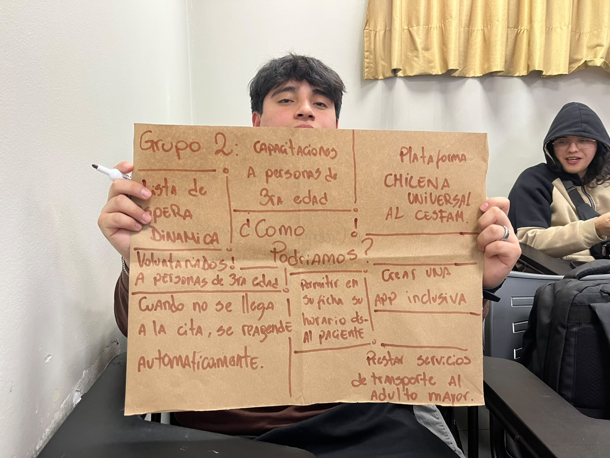

# Sesión 4 — Ideación: "¿Cómo podríamos...?"

📅 **Fecha:** 08-09-2026
**Participantes:** ⚠️ *por confirmar*
**Lugar o modalidad:** ⚠️ *por confirmar*

## 🎯 Objetivo de la sesión

Generar ideas de solución a partir de la pregunta "¿Cómo podríamos...?", a partir de todo lo investigado en las sesiones anteriores.

## 💡 Lluvia de ideas

Afiche "Grupo 2: ¿Cómo podríamos...?" con las siguientes ideas:

- **Lista de espera dinámica.**
- **Voluntariados a personas de 3ra edad** para apoyar capacitaciones a este grupo etario.
- **Cuando no se llega a la cita, se reagende automáticamente.**
- **Permitir en su ficha su horario disponible al paciente**, para facilitar la reasignación.
- **Plataforma chilena universal al CESFAM.**
- **Crear una app inclusiva.**
- **Prestar servicios de transporte al adulto mayor.**

## 🔗 Relación con el problema original

Varias de estas ideas responden directamente a las barreras identificadas desde el inicio del proyecto para las personas mayores: dificultad de movilidad (transporte al adulto mayor) y brecha digital (capacitaciones, app inclusiva, voluntariados de apoyo). El reagendamiento automático y la lista de espera dinámica atacan directamente la pérdida de cupos que motivó el proyecto.

## ➡️ Próximos pasos

- [ ] Completar participantes y lugar/modalidad de la sesión.
- [ ] Priorizar estas ideas y seleccionar cuáles se incorporan al prototipo de MediCita.
